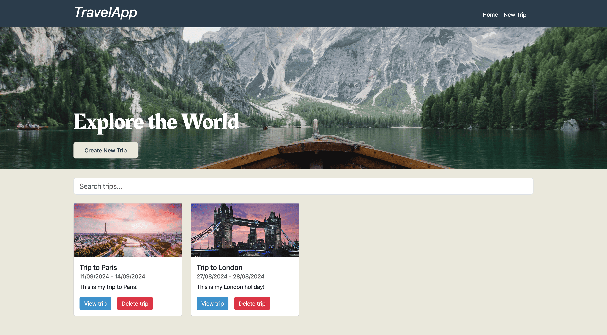

# Travel App



This is my Travel App. It lets you keep track of your trips by adding destinations for each day of the trip, descriptions, map locations, and photos.

## Table of Contents

1. [Prerequisites](#prerequisites)
2. [Installation](#installation)
   - [Clone the Repository](#clone-the-repository)
   - [Backend](#backend)
   - [Frontend](#frontend)
   - [Database](#database)
3. [Running the Application](#running-the-application)
   - [Backend](#backend-1)
   - [Frontend](#frontend-1)

## Prerequisites

Before you start, make sure you have the following installed on your machine:

- **PHP** (version 8.2.20 or higher)
- **Composer** (for PHP dependencies)
- **Node.js** (version 20.10.0 or higher)
- **npm** (Node Package Manager)
- **MySQL** (version 8.0.35 or higher)

## Installation

### 1. Clone the Repository

First, clone the repository to your local machine using Git:

```sh
git clone https://github.com/OgataiKhan/travel-app.git
cd travel-app
```

### 2. Backend

1. **Navigate to the Backend Directory:**

    ```sh
    cd backend
    ```

2. **Install PHP Dependencies:**

    Use Composer to install the required dependencies:

    ```sh
    composer install
    ```

3. **Configure Environment:**

    - Copy `.env.example` to `.env` and configure your environment variables, including database credentials:

    ```sh
    cp .env.example .env
    ```

    - Edit the `.env` file to set the correct database connection settings.

### 3. Frontend

1. **Navigate to the Frontend Directory from the root folder:**

    ```sh
    cd frontend
    ```

2. **Install Frontend Dependencies:**

    Use npm to install the necessary dependencies:

    ```sh
    npm install
    ```

3. **Configure Environment:**

    - Copy `.env.example` to `.env` and configure your environment variables:

    ```sh
    cp .env.example .env
    ```

    - Edit the `.env` file to set the correct API endpoint and any other configuration settings.

### 4. Database

1. **Create a New MySQL Database:**

    Create a new database for your project in MySQL. For example:

    ```sql
    CREATE DATABASE your_database_name;
    ```

2. **Run Database Migrations:**

    Navigate to the backend directory and run the `run_migrations.php` script to set up the database tables:

    ```sh
    php api/run_migrations.php
    ```

## Running the Application

### Backend

1. **Start the Backend Server:**

    You can use PHP's built-in server or any other server software to start the backend server. For example, with PHP:

    ```sh
    php -S localhost:8000 -t public
    ```

2. **Verify the Backend is Running:**

    Open your browser and go to `http://localhost:8000` to ensure the backend is running correctly.

### Frontend

1. **Start the Frontend Development Server:**

    From the `frontend` directory, run:

    ```sh
    npm run dev
    ```

2. **Verify the Frontend is Running:**

    Open your browser and go to `http://localhost:8080` (or the port specified) to see the frontend in action.
